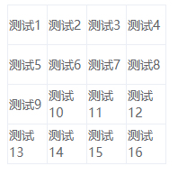
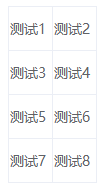
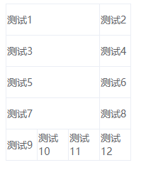

## 简介
可以根据数据动态生成的可合并行列的表格。

## 文档
### 数据选项
```js
options: {
    cols: 6, // 要生成的表格列数
    rows: 7, // 要生成的表格行数 这个表是 7 * 6
    merge: [ // 多个合并规则
        {
            row: 0, // 起始行
            col: 0, // 起始列
            rowspan: 2, // 占2行，默认为 1 ，为 1 时可不填
            colspan: 2, // 占2列
        },
        {
            row: 0,
            col: 2,
            rowspan: 2,
            colspan: 2,
        },
    ],
    data: [ // 表格数据，生成表格后将数据按顺序一一填充到表格
        { content: '测试1', id: 10, a: 100, b: 100 }, // content 字段为表格的内容
        { content: '测试2' },
        { content: '测试3' },
    ],
},
```
### 事件
组件可监听 `click` 事件，回调函数事件参数格式：
```js
// 当前点击的 td 的数据，数据索引，行数据，行索引，列索引
handleClick(data, index, rowData, row, col) {
    console.log(data)
    console.log(index)
    console.log(rowData)
    console.log(row)
    console.log(col)
},
```
### [在线 DEMO](http://jsrun.net/xmvKp/edit)
### 注意事项
假设你创建了一个 `4*4` 的表格，如下图所示。



现在每一行你都合并了 3 列，这时表格会发生崩溃现象。



这是表格自身的问题，和组件无关。要解决此问题，只需再加一行没有合并的表格即可。



## 使用
### 在单文件组件中引用
```
npm i vue-mergeable-table
```

```
import VueMergeableTable from 'vue-mergeable-table'

Vue.use(VueMergeableTable)
```
```
<template>
    <div id="app">
        <VueMergeableTable :options="options" @click="handleClick" />
        // 或者 <vue-mergeable-table :options="options"/>
    </div>
</template>
```

### 在HTML文件中直接引用
使用的是dist目录中的 `vue-mergeable-table.js`
```
<div id="app">
    <vue-mergeable-table :options="options" @click="handleClick"></vue-mergeable-table>
</div>
```
