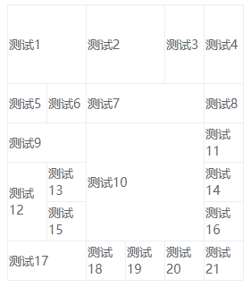

## 简介
可以根据数据动态生成可合并行列的表格。



## 文档
### [在线 DEMO](http://jsrun.net/xmvKp/edit)

### 数据选项
数据选项有两个字段要注意：
1. content，单元格内容字段
2. class, 单元格类名字段
```js
options: {
    cols: 6, // 要生成的表格列数
    rows: 7, // 要生成的表格行数 这个表是 7 * 6
    data: [ // 表格数据，生成表格后将数据按顺序一一填充到表格
        { content: '测试1', id: 10, a: 100, b: 100, class: 'test' }, // content 字段为表格的内容
        // 需要合并的数据需要填入一个 merge 对象
        // row col 为起始行列，rowspan 和 colspan 为合并的行数，值默认为 1，为 1 时可以不填
        // 这代表这个数据要放在 row 为 3，col 为 1 的单元格上，并且占 3 行 1列
        { content: '测试2', merge: { row: 3, col: 0, rowspan: 3 } },
        { content: '测试3' },
    ],
},
```
### 事件
组件可监听 `click` 事件，事件回调函数参数格式：
```js
// 当前点击的数据 行数据 行索引 列索引，返回的行数据 行索引 列索引均以合并后的表格为准
handleClick(data, rowData, row, col) {
    console.log(data)
    console.log(rowData)
    console.log(row)
    console.log(col)
},
```
### 注意事项
假设你创建了一个 `4*4` 的表格，如下图所示。


现在每一行你都合并了 3 列，这时表格会发生崩溃现象。


这是表格自身的问题，和组件无关。要解决此问题，只需再加一行没有合并的表格把表格撑开即可。


## 使用
### 在单文件组件中引用
```
npm i vue-mergeable-table
```

```js
import VueMergeableTable from 'vue-mergeable-table'

Vue.use(VueMergeableTable)
```
```html
<template>
    <div id="app">
        <VueMergeableTable :options="options" @click="handleClick" />
        // 或者 <vue-mergeable-table :options="options"/>
    </div>
</template>
```

### 在HTML文件中直接引用
使用的是dist目录中的 `vue-mergeable-table.js`
```html
<div id="app">
    <vue-mergeable-table :options="options" @click="handleClick"></vue-mergeable-table>
</div>
```
